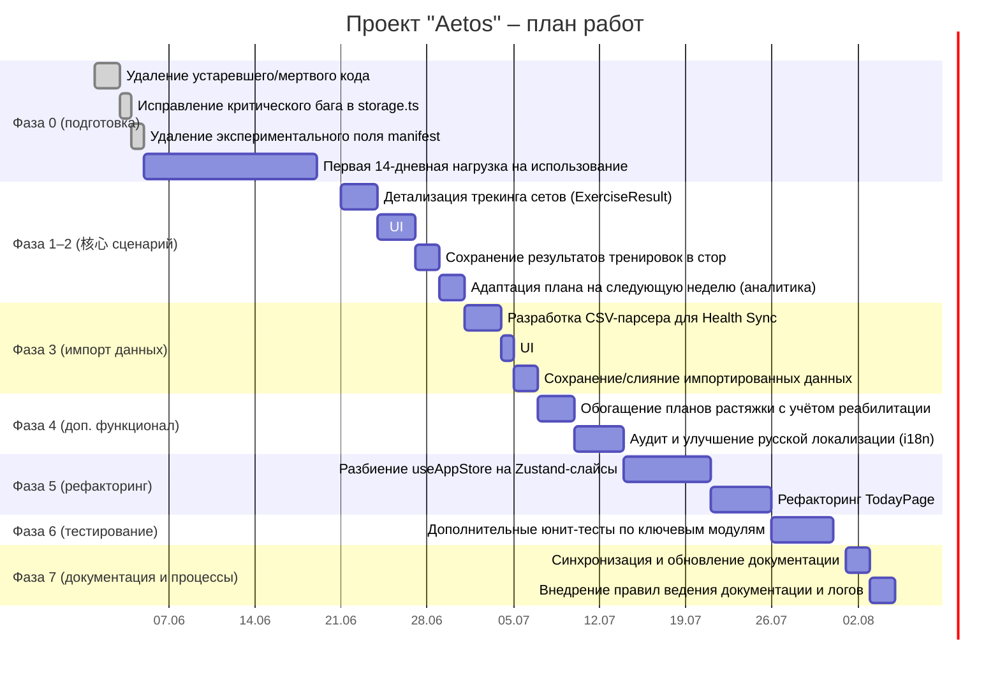

# Резюме  
Проект «Aetos» — это PWA-приложение «Health Operating System» для персонального цифрового тренера, цель которого – «дать человеку цифрового ментора по здоровью». Оба анализа отмечают сильную техническую основу: чистую архитектуру (Zustand, чистые функции, IndexedDB через Dexie), корректную реализацию ключевых алгоритмов (APRE-движок с 56 юнит-тестами, многоуровневый Recovery Score) и строгость TypeScript (0 ошибок компиляции, 244 пройденных теста). При этом выявлены серьёзные проблемы: приложение не используется ежедневно (отсутствует «пользовательская петля»), в нём много ненужных фич и нерефакторенного кода (большая TodayPage, огромный `useAppStore`), и покрытия тестами не хватает на важные модули. На основе обоих документов мы формируем подробный план доведения проекта до production-ready состояния. Основные направления: сфокусироваться на ядре (отслеживание подходов, адаптация плана), убрать или отложить лишние функции, рефакторинг сторов/компонентов, обеспечить интеграцию данных (импорт из Huawei Health) и полное покрытие ключевой логики тестами. Представленный ниже роадмап и техническое задание детализируют эти шаги, а рекомендации и чек-лист помогут контролировать качество и запуск проекта.

# Обзор проекта  
Проект описан как клиентское оффлайн-ориентированное PWA-приложение (кодовое имя «Aetos»), предназначенное для управления тренировочным планом и мониторинга состояния здоровья пользователя. В `VISION.md` заявлена миссия: «дать человеку персонального цифрового ментора, который знает о его теле больше, чем он сам, и помогает становиться здоровее». Архитектурно приложение построено на React/TypeScript с использованием Zustand для состояния и Dexie (IndexedDB) для локального хранилища. В нём реализованы ключевые фитнес-модули: APRE-алгоритм для автокалибровки нагрузок, многоуровневый Recovery Score, генерация планов тренировок и растяжек на основе данных, а также PWA-функции оффлайн-доступа.  
   
По текущему коду видно: строгая типизация TypeScript, хорошее покрытие юнит-тестами в ядре APRE, начальная поддержка PWA (манифест, сервис-воркер), мультиязычный интерфейс и структура для i18n, базовые настройки CI/e2e. Однако часть UI ещё наследует старый синтаксис React.createElement (TodayPage.jsx), и множество устаревших компонентов/страниц уже не используются, а большая часть хранилища (`useAppStore.ts`) перегружена логикой. Это подтверждает анализ: архитектура в целом правильная, но требует упрощения и переработки ключевых компонентов.

# Сильные стороны проекта  
- **Чистая архитектура и технологии**: Как отмечено в анализе, используется “Zustand store, чистые функции, IndexedDB через Dexie” – это современный подход к хранению и управлению состоянием. Код на TypeScript без ошибок компилируется, что снижает количество рантайм-багов.  
- **Корректная реализация ключевых алгоритмов**: APRE-движок (авто-прогрессивная регрессия нагрузок) имеет 56 покрывающих тестов, что гарантирует точность расчетов. Recovery Score спроектирован с тремя уровнями готовности – эта логика последовательно интегрируется в планировщик. К тому же, были валидации таких вещей, как прогрессия для калистеники и ACWR (соотношение нагрузки), как «правильно обоснованные» по анализу.  
- **Наличие PWA и i18n**: Проект уже реализован как PWA (манифест, офлайн-режим), что позволяет устанавливать его как приложение. Заложена структура для мультиязычности (ru.json и англ. локаль). Эти наработки ускорят вывод в продакшен глобально (например, можно быстро добавить новые языки).  
- **Покрытие тестами для ядра**: Несмотря на упомянутые проблемы, основной модуль `apre/engine.js` покрыт тестами. Это база, на которой можно строить дальнейшие улучшения без страха сломать алгоритмы.  
- **Готовность к дальнейшему развитию**: В документации и структуре кода прослеживаются намерения по расширению (например, разделение планов на фазы, поддержка разных спортов, экспорт/импорт данных). Проект заложен как экосистема с намерением развиваться, что является хорошей отправной точкой.

# Основные проблемы и ограничения  
- **Низкое вовлечение пользователя**: Ключевым недостатком (и риском) является то, что приложение практически не используется каждый день. Фактически, “продукт не используется” – пользователь не открывает его каждое утро. Без реального использования любые улучшения бесполезны. Следовательно, необходимо с самого начала вовлечь себя (и потенциально других) в ежедневное взаимодействие с приложением, чтобы выявить реальные баги и узкие места (как рекомендовано в анализе).  
- **Перегруженный и устаревший код**: Много «мертвого» или ненужного кода: старые UI-компоненты, неиспользуемые страницы и директории (например, устаревшая папка `ui/`), а также неиспользуемые части стор-структуры (useSettingsStore.ts, useUIStore.ts и т.д.). Также `TodayPage.jsx` (≈800 строк) и `useAppStore.ts` (≈1300 строк) чересчур большие и содержат устаревшую логику (legacy React, смешение ответственности). Это затрудняет поддержку и замедляет разработку.  
- **Неполное покрытие тестами критичных модулей**: Тесты есть, но не на всё. Как справедливо замечено, некоторые модули имеют нулевое или минимальное покрытие: `sessionLoad.ts` (0%), `loadAdjustments.ts` (~1%), часть хранилища (storage.ts ~15%). Отсутствие тестов на основные вычисления (например, корректировку нагрузки, расчёт сессии) увеличивает риск регрессий при изменениях.  
- **Незавершённые пользовательские сценарии**: В настоящее время “основная петля” разорвана: пользователь делает тренировку, но результаты подходов не сохраняются в хранилище, и система не адаптирует план на основе выполненного объёма. Типы `ExerciseResult` указаны, но данные не записываются в `Session`. Без этого ключевого сценария приложение бесполезно для пользователя.  
- **Неавтоматизированный ввод данных**: Отсутствует интеграция с внешними источниками (например, импорт биоданных из Huawei Health). Всё вводится вручную, что непрактично и вводит ошибки. Анализ подчёркивает, что автоматический импорт данных по сна и пульсу — самая ценная фича для владельца проекта. Без неё теряется существенная часть удобства.  
- **Фича-крип (Feature Creep)**: За время разработки было добавлено много направлений (восемь видов спорта, тестовые фреймворки, сложные функции).
  Многие из них сейчас не приносят ценности для ежедневного пользователя. Чтобы не уйти в бессмысленную сложность, следует удалить или отложить всё, что не нужно для базовой функциональности (ежедневная тренировка + адаптация + базовая реабилитация).  
- **Документация и процессы**: Некоторые документы устарели (`README`, `memory-bank/progress.md` и т.п.), а правило ведения документации не закреплено жестко. Отсутствие своевременного обновления документации приведёт к рассинхрону между кодом и описаниями.  

# Детальный план работ и техническое задание  

Ниже представлена дорожная карта (роадмап) по этапам (приблизительно по неделям) с основными задачами каждого этапа. Она основана на рекомендациях из анализа и охватывает весь цикл доведения проекта до production-ready.



**Этап Фаза 0: Подготовка (Неделя 0)**  
- *Удаление мёртвого кода* – удалить устаревшие UI-компоненты, страницы и фиктивные файлы, которые не используются (папка `ui/`, страницы InfoPage/NutritionPage/etc.). Аналогично очистить хранилища: удалить `useSettingsStore.ts`, `useCheckinStore.ts`, `useUIStore.ts` и т.п., а также неиспользуемые тесты и скрипты. Это сократит объём кода и потенциальные ошибки. После удаления – прогон линтеров, билд и тестов; сборка должна быть зелёной.  
- *Исправление критического бага (storage.ts)* – в коде хранилища (`storage.ts`) используется «голый» `db`, что игнорирует demo-режим; это может порчить данные (описанный пример с `getAllSessions()`). Необходимо заменить все обращения `db.` на функцию `_db()`, чтобы выбирать активную базу (demo или реальную). Написать тест для этого: при включенном demo-режиме данные не должны попадать в реальную БД.  
- *Убрать экспериментальную опцию в манифесте* – в `manifest.json` удалить поле `"launch_handler"`, потому что оно экспериментально и не приносит пользы обычному пользователю (Chrome-specific).  
- *Наладить ежедневное использование приложения* – в течение 14 дней подряд использовать приложение «с головой»: заполнять чек-ин утром (пульс, сон, субъективные оценки), выполнять тренировки, отмечать каждое выполненное упражнение и RPE. Фиксировать замеченные баги и неудобства. Это даст реальный список проблем (а не гипотетических).

**Этап Фаза 1–2: Основная логика (Недели 1–4)**  
*Цель:* обеспечить полную «пользовательскую петлю» тренировки → запись данных → адаптация плана.  
- **1. Детализация трекинга сетов (types.ts)**. В `types.ts` расширить структуру `ExerciseResult` и ввести `SetResult`: хранить номер сета, плановые/фактические повторения и вес, флаг выполнения и RPE. Добавить эти поля в `Session` (массив `exerciseResults`, поля боли/усталости после сессии).  
- **2. UI: ввод данных о подходах (ExerciseCard.jsx)**. В карточке упражнения добавить интерактивность для каждого сета: чекбокс «выполнен» и (для APRE-упражнений) поле для ввода числа повторений. Либо, проще, галочка «выполнено» (если кол-во совпадает с планом). Вызывать callback `onSetComplete(exName, setNumber, completedReps)` при отметке сета. Фокус – минимальный ввод пользователя, чтобы не тратить время на интерфейс.  
- **3. Сохранение результатов (useAppStore)**. Обновить стор: при каждом завершении сета сохранять `SetResult` в новое состояние `pendingExerciseResults`. В момент подтверждения сессии (handleToggleTraining) собирать все `pendingExerciseResults` и записывать в `Session.exerciseResults` перед сохранением сессии. При этом передавать последний completedReps сета 4 в APRE-логику для расчёта следующего RM (nextWeekRM). Добавить соответствующие методы в Zustand-слайс (например, `updateSetResult`).  
- **4. Тесты базовых сценариев**. Написать юнит-тесты: например, проверка расчёта процента выполнения тренировки (`completionRate`), интегрированный тест, что при вводе completedReps у set4 меняется nextWeekRM по формуле APRE. Это гарантирует корректность основных вычислений.  
- **5. Аналитика адаптации**. В модуле аналитики (`analytics.ts`) реализовать `calculateWeeklyCompletionRate(sessions, weekStart)`, который вычисляет отношение фактически выполненных сетов к запланированным за неделю. На основе этого создать функцию `getVolumeMultiplierFromAdherence(completionRate)` (в `planning.ts`), возвращающую множитель нагрузки: ≥0.8 → 1.2 (+20% объёма), ≥0.6 → 1.0, иначе 0.8. Интегрировать вызов этой логики в `computeDerived()`, чтобы при генерации плана на следующую неделю учитывать отдачу пользователя: повышать нагрузку, если он хорошо справляется, или делать разгрузочную неделю при невыполнении. Дописать тесты: проверить, что 85% даст 1.2×, 50% даст 0.8× и т.д.  

**Этап Фаза 3: Интеграция данных (Недели 5–6)**  
*Цель:* упростить ввод физических показателей (сна, пульса и т.д.) через импорт.  
- **1. CSV-парсер для Health Sync**. Создать модуль `js/core/import/csvParser.ts`. Определить формат (заголовки CSV от приложения Health Sync: дата, продолжительность сна, пульс, HRV). Реализовать `parseHealthSyncCSV(csvContent: string): ParsedBiometrics[]`, которое корректно распознаёт и парсит эти колонки, учитывая возможные вариации заголовков. Добавить функцию `mergeImportedBiometrics(records, getAllCheckins)` для слияния новых данных с уже существующими: дополнять поля (sleepHours, restHR, hrv) только если их ещё нет в БД.  
- **2. UI: кнопка импорта**. На странице профиля (`ProfilePage.jsx`) добавить отдельную кнопку «📲 Импорт из Health Sync (CSV)» с подписью «Загрузите CSV из Health Sync для автозаполнения сна и пульса». После успешного импорта отображать уведомление (toast) вида «Обновлено X записей, пропущено Y (уже заполнены)».  
- **3. Тесты CSV-парсера**. Написать юнит-тесты для `parseHealthSyncCSV` и `mergeImportedBiometrics`: убедиться, что корректный CSV парсится во множество записей с правильными числами, а пустой или пустой контент не ломает функцию.  

**Этап Фаза 4: Дополнительные улучшения (Недели 7–8)**  
*Цели:* повысить качество плана реабилитации и готовность к интернационализации.  
- **1. Реабилитация в растяжках**. В системе планов (`js/plans/stretching.ts` и `exerciseDatabase.ts`) добавить поддержку тегов для упражнений на растяжку в зависимости от проблем. Например, расширить `exerciseDatabase` и определить `rehabStretchMap` по направлениям (плечи, спина, бёдра) с включающими/исключающими упражнениями. В функциях сборки фаз (`basePhase/`, `buildPhase/`, `peakPhase/`) применять фильтр: если у пользователя есть проблемы (rehabIssues), исключать упражнения, которые могут навредить (например, «нагруженные» вариации). Это добавит индивидуальности тренировкам при травмах.  
- **2. Улучшение переводов (i18n)**. В коде находятся русифицированные строки-транслитерции («Plevoy sustav» и т.д.) – их нужно заменить на нормальные ключи i18n. В файле `js/i18n/locales/ru.json` добавить недостающие переводы (например, «shoulder_mobility»: «Мобильность плечевого сустава», «wall_slides»: «Скольжения по стене» и т.д. из анализа). Провести аудит: не пытаться сразу переписать весь UI, а постепенно оборачивать текстовые литералы в функцию `t()` по мере работы над компонентами. Начать, например, с `CheckinForm.jsx` и часто используемых элементов. Это упростит дальнейшую локализацию.  
- **3. Дизайн страницы Today (фронтенд)** – если в этой фазе есть время, можно немного поработать над визуальными компонентами (иконки на кнопках чек-ина, упрощение интерфейса), но основное – оставить на поздние доработки.  

**Этап Фаза 5: Рефакторинг кода (Недели 9–10)**  
*Цель:* существенно улучшить читабельность и поддерживаемость кода.  
- **1. Разбиение `useAppStore` на слайсы**. Вынести состояние на несколько Zustand-модулей (slices) по функциональным зонам:  
  - *checkinSlice.ts*: состояние чек-ина (вес, пульс, сон, симптомы и т.д.) и действия `setWeight`, `setRestHR`, `handleSaveCheckin`.  
  - *sessionSlice.ts*: состояние тренировки (RPE, заметки, результаты сетов (`pendingExerciseResults`) и т.д.) и действия `setRpe`, `updateSetResult`, `handleToggleTraining`.  
  - *uiSlice.ts*: состояние UI (активная вкладка, модалки, тосты, override режима) и соответствующие сеттеры.  
  - *dataSlice.ts*: глобальные данные (список сессий, чек-инов, выбранные спорта/гаджеты/реабилитации, состояния демо) и действия (`initApp`, `handleExportData`, `handleImportData`, `handleResetAll`).  
  - *demoSlice.ts*: режимы demo/guest и коррекция текущей даты.  
  После выделения слайсов `useAppStore` должен остаться лишь «оркестратором», соединяющим их и хранящим функцию `computeDerived()`. Это улучшит разделение ответственности и облегчит тестирование логики отдельно.  
- **2. Рефакторинг TodayPage**. Страница Today содержит много кода: разбейте её на компоненты. Выделите по одному файл для каждого блока интерфейса:  
  ```
  js/ui/components/today/
    - HeroRing.tsx        (окружение дневного фона/кольца готовности)
    - SparklineCard.tsx   (графики восстановления/нагрузки)
    - ExerciseList.tsx    (список упражнений с вводом подходов)
    - WeeklyStrip.tsx     (недельный календарь)
    - QuickActionToggle.tsx
    - TomorrowPreview.tsx
    - CoachTipsPanel.tsx
  ```  
  При выносе сразу конвертировать код из `React.createElement` в JSX. После этого `TodayPage.jsx` станет тонким контейнером (~100–150 строк), который просто складывает эти компоненты, что существенно улучшит читаемость и поддержку.  

**Этап Фаза 6: Покрытие критических модулей тестами (Недели 11–12)**  
*Цель:* обеспечить надёжность ключевых вычислений.  
- **1. `loadAdjustments.ts`** – файл, отвечающий за адаптацию нагрузки (дельoad, путешествия и т.д.), сейчас почти не покрыт тестами. Добавить тесты, проверяющие:  
  - `getWeeklyMultiplier(args, currentWeek=4)` должен дать 0.6 (deload).  
  - `getWeeklyMultiplier(args, currentWeek=1)` = 1.0.  
  - `applyApreAdjustment` – если нет предыдущей сессии, то массив упражнений не изменяется.  
  - `adjustExercisesForMode(exercises, 'minimum')` возвращает только recovery-упражнения (все эксерсайзы проходят через `isRecoveryExercise`).  
- **2. `sessionLoad.ts`** – функция вычисляет нагрузку (RPE × длительность), но использует защиту через `Number()` и `Math.max()`. Написать тесты для крайних случаев: RPE=0 или длительность=0 → результат 0, стандартный случай (7×45 мин = 315), и отсутствие аргумента длительности (должно использовать default 45 мин). Это поднимет покрытие с 0% до 100%.  
- **3. `advice.ts`** – модуль советов коуча. Имеющиеся тесты нужно расширить:  
  - `getCoachAdvice(35, {})` (низкий Recovery Score) – должен вернуть советы по восстановлению (проверить, что в тексте есть слова «отдых», «восстановл» и т.п.).  
  - `getCoachAdvice(80, {})` (высокий Score) – должен вернуть тренировочные советы (длина массива > 0).  
  Это повысит покрытие с ~30% до ≥70%.  
- **4. Общее тестирование** – убедиться, что после всех изменений `npm test` проходит без падений. Добавить новые тесты по мере фиксов и рефакторинга.  

**Этап Фаза 7: Документация и процессы (Ongoing)**  
*Цель:* установить дисциплину поддержки проекта.  
- **1. Синхронизировать документацию** – провести ревизию текстов и данных в описаниях:  
  - В `README.md` обновить версию TypeScript с «6» на реальную (5.x).  
  - В `memory-bank/progress.md` убрать старый счётчик ошибок («142 failures»), если он устарел.  
  - В `docs/reference/PROJECT_CONTEXT.md` обновить статусы Фазы 5 (разбиение на слайсы, TodayPage) и прочие изменения.  
  - В `AGENTS.md` удалить упоминания о несуществующих файлах/директориях (после удаления legacy-кода).  
- **2. Регламентация коммитов** – ввести правило: документация – часть коммита. Запрещено отдельным коммитом делать только `docs`, напротив, каждый коммит, меняющий API или архитектуру, должен обновлять соответствующие README/документацию. Это зафиксирует актуальность описания проекта.  
- **3. Сессийный лог (документация работы)** – вести короткие отчёты о каждой сессии разработки (файл `docs/sessions/YYYY-MM-DD-*.md`). Формат: цель сессии (1 строчка), что сделано (пункты), что осталось или сломано (пункты). Это упростит отслеживание прогресса и придаст прозрачность развитию.  

# Риски и противоречия  
Основные риски связаны с **реальным использованием приложения**. Если им не будут пользоваться ежедневно, то все улучшения не принесут пользы. Чтобы снизить риск, нужно с самого начала начать активное использование (см. Фаза 0) и, возможно, привлечь пилотных пользователей (других спортсменов) для раннего фидбэка. Также важно не перегрузить фичами: несогласованное добавление новых функций (feature creep) может снова усложнить продукт. Это прямо указано в анализе как «задача убрать всё, что не нужно для ежедневной перки».  

Технические риски: рефакторинг `useAppStore` и TodayPage большой нагрузки – их стоит выполнять осторожно, поэтапно, контролируя каждый шаг тестами. Несогласованность моделей данных между слоями (например, если `Session` теперь содержит `exerciseResults`) нужно синхронизировать с базой. Также возможны конфликты при слиянии данных CSV (проверять совпадение по дате и ключам).  

Противоречий между документами нет – анализ вторит самому себе: оба источника указывают на необходимость сфокусироваться на ежедневной петле и упростить код. Единственное доп. замечание: Gemini упоминал корректность научной обоснованности и благоприятное время на рынке, чего не отрицал другой анализ. Это значит, что качественная реализация проекта имеет потенциал успеха.  

# Практические рекомендации по исполнению  
- **Начните пользоваться приложением каждый день** (минимум 2 недели) – так выявите реальные баги, UX-проблемы и недостатки логики, которые не выплывут просто при просмотре кода.  
- **Фокусируйтесь на ценности для пользователя**: реализуйте сначала обязательные сценарии (ввод результатов тренировки, адаптация, импорт биоданных). Удалите или «спрячьте» всё, что не даёт ежедневной пользы (анализ рекомендует оставить только `тренировка + растяжка` для текущих целей).  
- **Строгая дисциплина тестирования**: прежде чем выпускать изменения, покройте важные модули тестами. Особенно `computeDerived()`, `sessionLoad()`, `loadAdjustments()`, UI-функции. Тесты должны проходить в CI, а непокрытый критичный код – это зона риска.  
- **Следуйте выбранному паттерну разработки**: после рефакторинга использовать Zustand slices для новых функций, вести чистую архитектуру (модули core со своими тестами и минимальными побочными эффектами). Не возвращайтесь к монолитному стору или устаревшим стилям (CreateElement в TodayPage).  
- **Коммиты с документацией**: привыкайте обновлять README и комментарии одновременно с кодом. Каждая новая фича, измененный алгоритм или структура данных должны быть описаны в текстах проекта. Это облегчит поддержку и передачу проекта в будущем.  
- **Мониторинг метрик успешности**: за 3 месяца проект считается успешным, если вы **действительно используете приложение каждое утро**, оно знает ваш сон и пульс, а план адаптируется под фактическую нагрузку. Конечный пользователь здесь – один человек (вы). Если вы видите, что ежедневно приложение приносит пользу (метрики: процент выполнения плана, пользователь открывает его постоянно), можно говорить о продуктивности.  

# Чек-лист готовности к продакшену  
- [ ] **Основная функциональность**: полный сценарий «тренировка→запись→адаптация» работает без ошибок. Пользователь может отметить выполненные подходы, и план следующей недели автоматически адаптируется (см. расчёт объёма).  
- [ ] **Интеграция данных**: импорт Biometric CSV работает корректно (данные сна/пульса загружаются), и это отражается на показателях в профиле/рекомендациях.  
- [ ] **Качество кода**: большая часть кода рефакторена (store разбит на слайсы, TodayPage разобрана на компоненты), удалены устаревшие модули. Соблюдаются кодстайл и правила (ESLint/Prettier).  
- [ ] **Покрытие тестами**: ключевые логические модули покрыты тестами и CI вывод зелёный. Покрытие основных функций (аджастмент нагрузки, расчёта RPE и т.д.) не ниже ~80%.  
- [ ] **UI/UX готовность**: интерфейс интуитивен, переводы (хотя бы RU/EN) корректны, нет «латиницы» или транслита. Пользователь не ломается при работе (показываются уведомления, ошибки понятны).  
- [ ] **Документация**: README и другие текстовые файлы актуализированы (нет упоминаний про нереализованные фичи), есть короткая инструкция по запуску/коммитам. Наличие сессионного лога разработки.  
- [ ] **PWA и сохранность данных**: приложение устанавливается и работает оффлайн (после первой загрузки). Все введённые данные (сессии, чекины) надёжно сохраняются в IndexedDB.  
- [ ] **Требования безопасности**: нет чувствительных открытых данных, зависимости обновлены до последних стабильных версий.  

При выполнении всех этих пунктов проект можно считать **готовым к продакшену**. Основной метрикой успеха будет регулярное использование приложения и реальное улучшение ваших тренировок: система должна знать ваш сон и пульс, а вы каждый день видеть актуальные рекомендации. Если это выполняется, значит работа выполнена успешно. 

